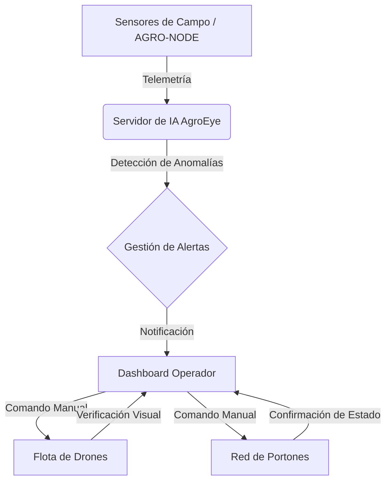

# 🛰️ AgroEye Live AI
### *Plataforma de Operaciones Agrícolas de Grado Industrial*

---

  <b>Monitorización satelital, despliegue de drones y control de actuadores en tiempo real.</b> 
  AgroEye transforma la gestión rural en una operación ciberfísica de alta precisión.

## 🚀 Funcionalidades Principales

### 🛸 Ecosistema de Drones Tácticos
*   **Inspección 4K**: Zoom digital de 2.8x con enfoque automático en objetivos.
*   **Navegación Táctica**: Reubicación de unidades mediante clics directos en el mapa.
*   **Relay de Energía**: Sistema automático de rotación (Hangar -> Misión -> RTH) para cobertura ininterrumpida.

### 🔒 Red de Seguridad Perimetral
*   **Actuadores de Acceso**: Control remoto de portones Norte, Sur, Este y Oeste.
*   **Verificación Visual**: Cámara de dron integrada para confirmar cierres físicos y seguridad.
*   **Protocolos de Mitigación**: Activación de aspersores de riego preventivo ante riesgos de incendio.

### 📋 Sistema de Auditoría Industrial
*   **Trazabilidad Total**: Registro inalterable con fecha, hora, sensor fuente y estado de atención.
*   **Centro de Filtrado**: Búsqueda avanzada por severidad, categoría y fecha.

---

## 🔔 Catálogo de Notificaciones y Alertas

El sistema AgroEye utiliza IA para clasificar eventos en tiempo real. Aquí el detalle de cada protocolo:

| Tipo de Alerta | Severidad | Origen del Sensor | Acción Recomendada |
| :--- | :--- | :--- | :--- |
| **🔥 Fuego / Humo** | 🔴 CRÍTICA | Sensor Térmico / Óptico | Desplegar Dron + Activar Riego Preventivo |
| **🐮 Ganado Fuera** | 🟡 MEDIA | Biometría GPS | Inspección visual para verificar rotura de vallas |
| **🔓 Portón Abierto** | 🔴 ALTA | Actuador Magnético | Comando de cierre remoto + Verificación con Dron |
| **🌡️ Temp. Extrema** | 🟡 MEDIA | AGRO-NODE (Ambiente) | Activar protocolos de hidratación de ganado |
| **🌱 Humedad Baja** | 🟢 BAJA | Sensor de Suelo | Programación de ciclo de riego en zona afectada |

---

## 🏗️ Arquitectura del Sistema

---

### 🛠️ Configuración Rápida

1. `pnpm install`  
2. `pnpm dev`  
3. Accede a `localhost:3000`

---
© 2026 **AgroEye Team** | *Eficiencia. Seguridad. Innovación.*

